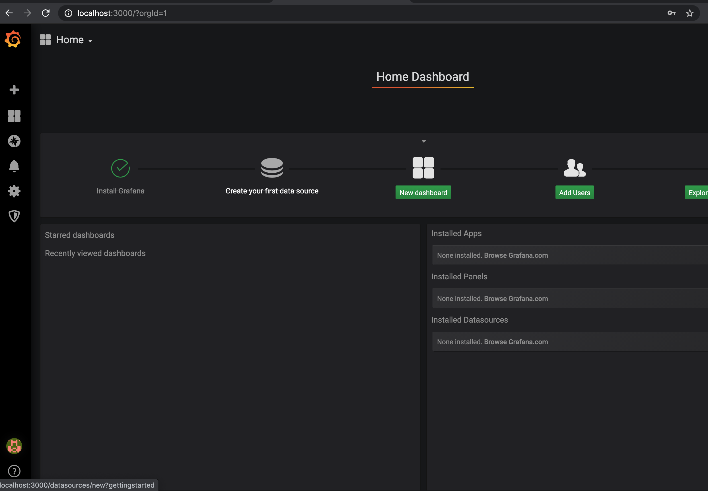
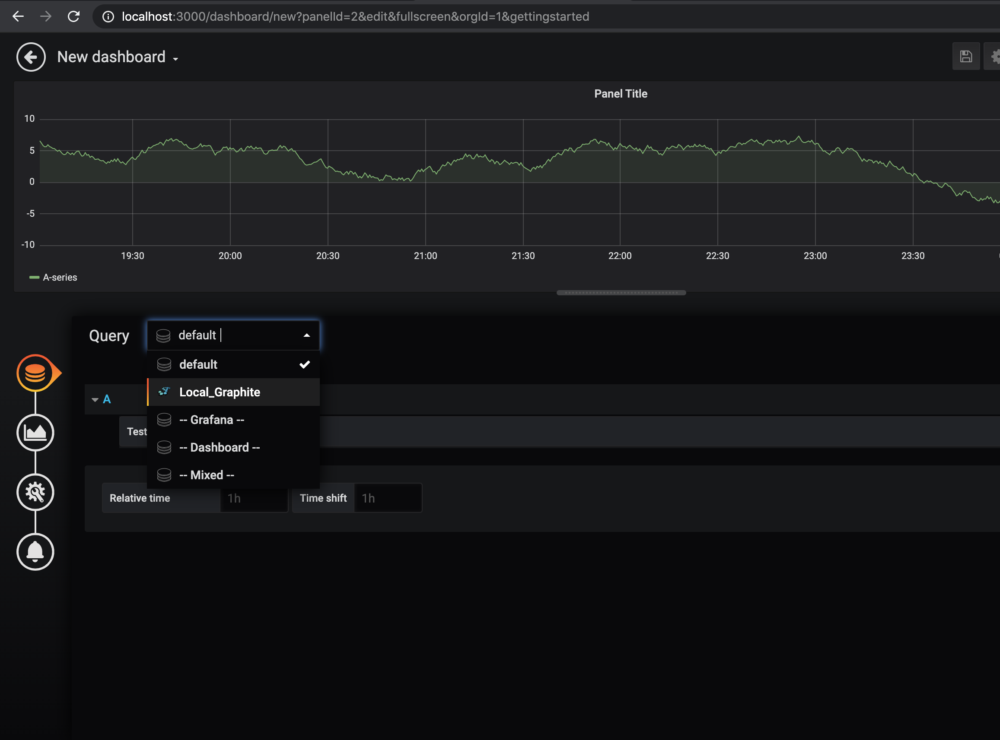
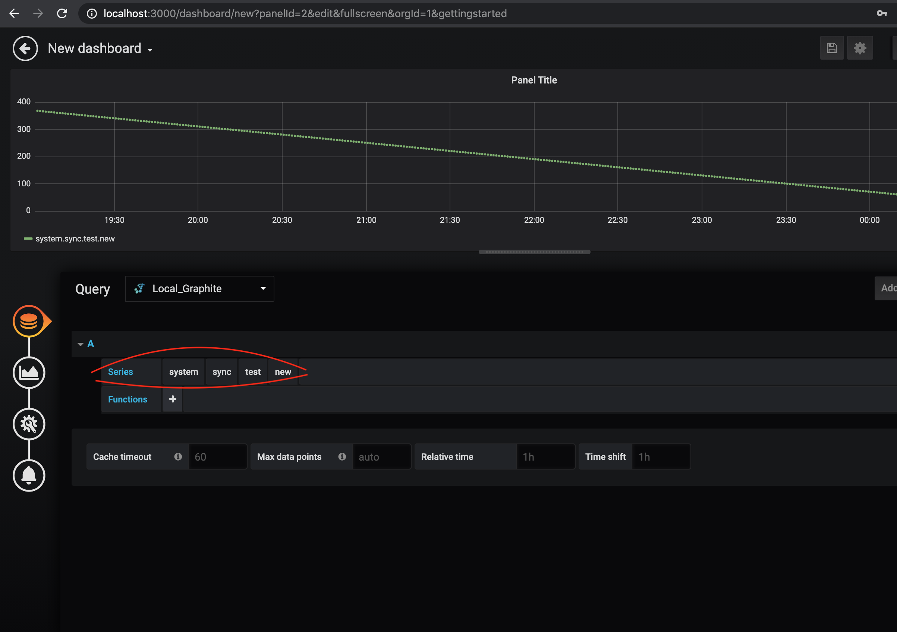

# Graphite_Grafana

This repo will  setup a graphite and grafana (configured to talk to each other) instance using docker compose, so an end user can expirement and learn Grafana/Graphite.

I had built this to learn graphite and grafana on my local machine after finding out that back in the day (when I was learning graphite and grafana 2019's), there was no open-source implementation of containerized graphite and grafana which were connected to each other. 

This repo tries to help an end user to start learning about graphite and grafana without the hassle of trying to setup these instances (on vm's/locally). There also is no need to connect these instances and worry about the networking shenanigans.

The Pre-requiste for to use the repo is you should have docker and docker-compose installed on your local machine.

## How to use the above code.

### 1 <code>git clone https://github.com/Virajdatt/Graphite_Grafana.git</code>
### 2 <code>cd Graphite_Grafana</code>
### 3 <code>make create_volumes</code>
### 4 <code>make dbuild</code>
Wait for the command here to build the docker image and spin up the container. The time taken here is based on your network speed.
### 5 Then open a browser and hit the link http://localhost:3000, it should open the grafana link, login using default creds 
- usename:- admin 
- password:- admin

## What this Repo does.

1. It creates a few folders in your home directory to use as docker volumes and also copies a few grafana related files.
2. It pulls down a graphite image.
3. It builds a grafana image and adds the  configs from the volumes to talk to the graphite built.
4. Creates and destorys a python container that adds some dummy data into your graphite that you can vizualize using Grafana later on.

## How to vizualize the dummy data (mentioned in the step 4 above).

1. Frome home directory click on New Dashboard

2. From there on in Query select the Local_Graphite

3. Continue selecting fields as shown below

## Now go ahead and have fun and your graphite link will be on http://localhost