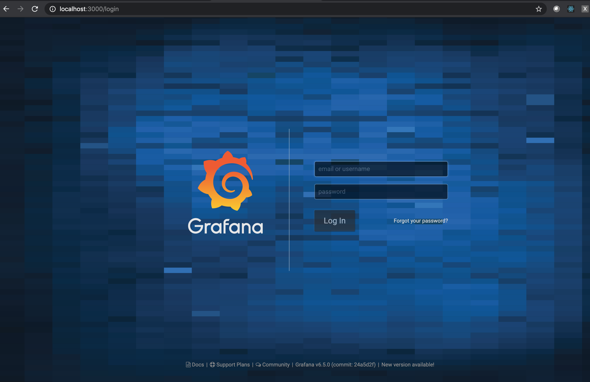

# Graphite_Grafana

This repo will  setup a graphite and grafana (configured to talk to each other) instance using docker compose, so an end user can expirement and learn Grafana/Graphite.

I had built this to learn graphite and grafana on my local machine after finding out that back in the day (when I was learning graphite and grafana 2019's), there was no open-source implementation of containerized graphite and grafana which were connected to each other. 

This repo tries to help an end user to start learning about graphite and grafana without the hassle of trying to setup these instances (on vm's/locally). There also is no need to connect these instances and worry about the networking shenanigans.

The Pre-requiste for to use the repo is you should have docker and docker-compose installed on your local machine.

## How to use the above code.

### 1 <code>git clone https://github.com/Virajdatt/Graphite_Grafana.git</code>
### 2 <code>cd Graphite_Grafana</code>
### 3 <code>make create_volumes</code>
### 4 <code>make dbuild</code>
### 5 then open a browser and hit localhost:3000, should open the grafana link, login using default creds 
- usename:- admin 
- password:- admin

